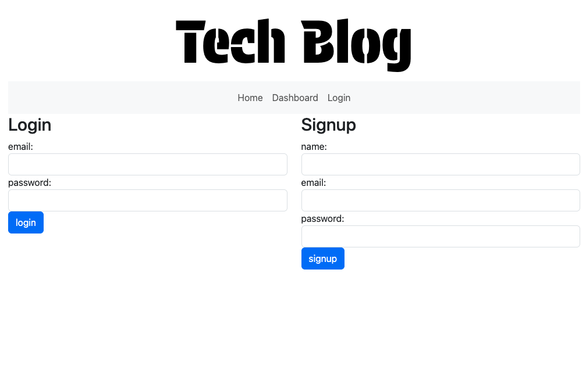
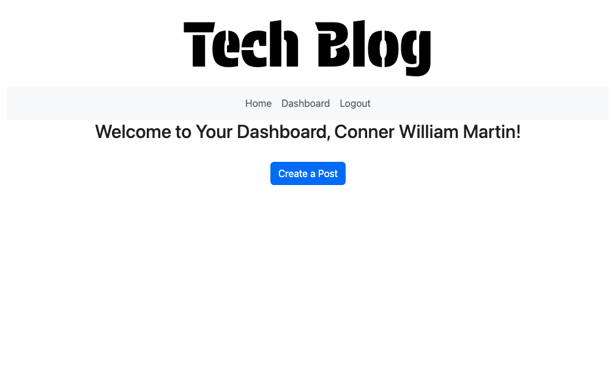
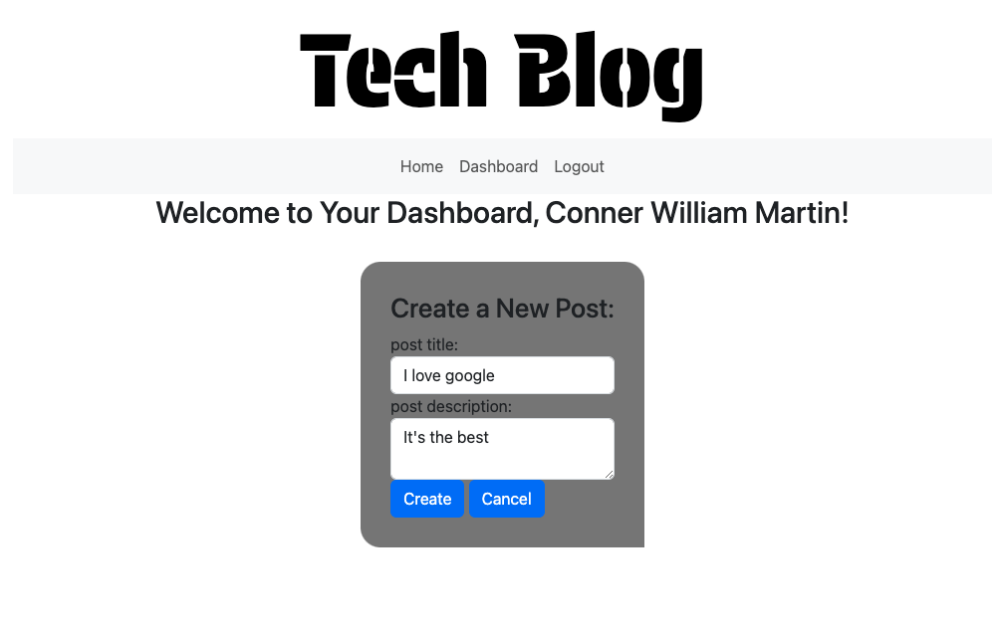
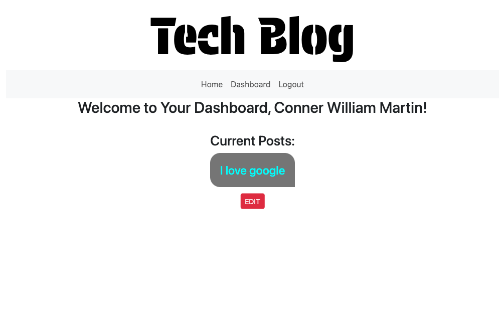
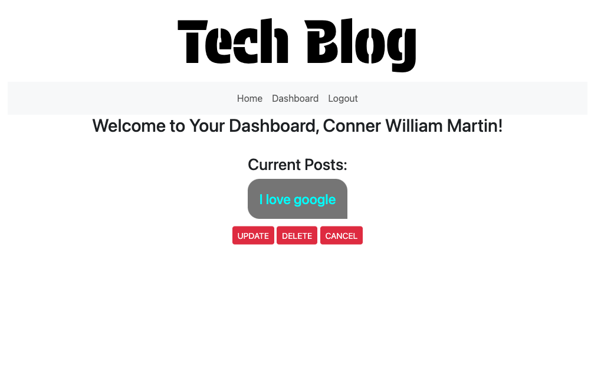
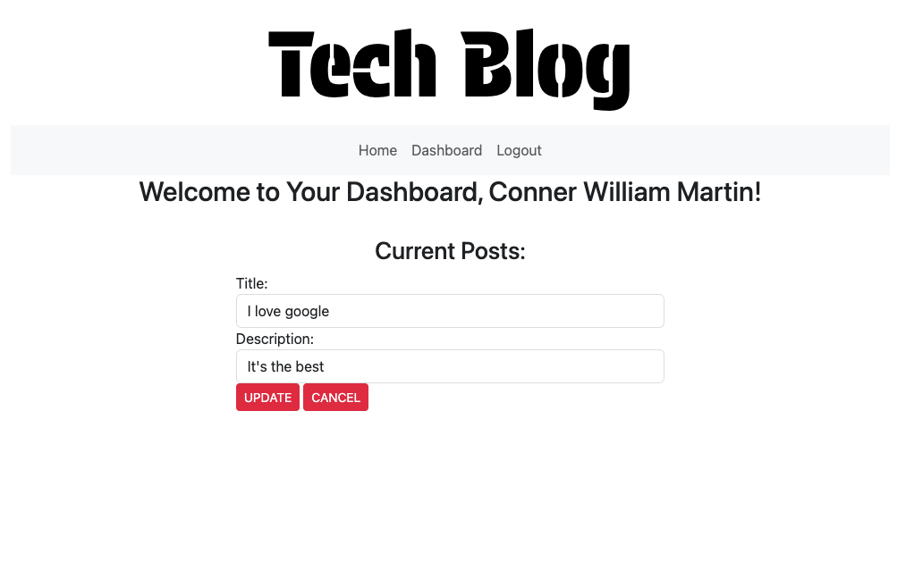
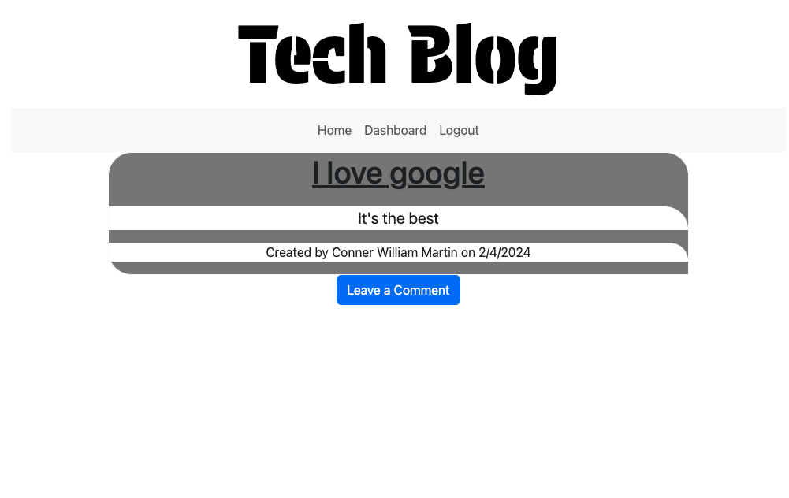
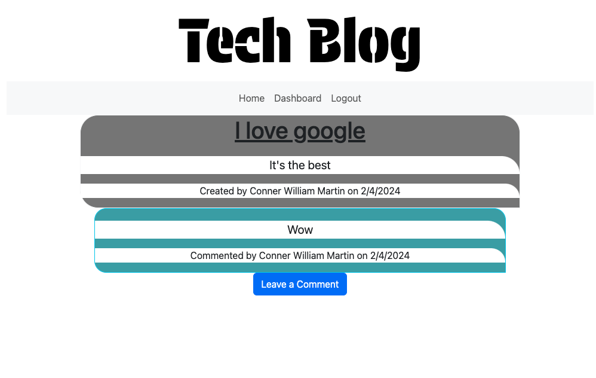

# MVC-Tech-Blog...make it count

## Table of Contents

[Description](#description)
 
[Technologies Used](#technologies-used)
 
[Usage](#usage)
 
[Credits](#credits)

## Description

The aim of this innovative blog is to empower users with the ability to create and share impactful posts, allowing each user to have only one post at a time. This unique approach enhances the significance of each post, fostering meaningful engagement and discussions within the tech community.

It follows the MVC paradigm in its architectural structure, using Handlebars.js as the templating language, Sequelize as the ORM, and the express-session npm package for authentication.

You can find the deployed application [here](https://afternoon-basin-69831-98d2be827880.herokuapp.com/)

The following screenshots demonstrates the applications functionality: 
 
Login/Signup:
 

 
Homepage:
 

 
Dashboard:
 

 
Create a Post:
 

 
Dashboard with Post:
 

 
Post Options:
 

 
Post Update:
 

 
Leave Comment:
 

 
Post With Comment:
 

 

## Technologies Used

* HTML (Handlebars.js)
* JavaScript
* CSS
* Bootstrap
* Node.js
* dotenv
* Express.js
* Express-session
* MySQL Database
* Sequelize
* bCrypt for password hashing

## Usage

* When you visit the site for the first time, you are presented with the homepage, which includes existing blog posts if any have been posted; navigation links for the homoepage and the dashboard; and the option to log in.
* When you click on the homepage option, you are taken to the homepage
* When you click on any other links in the navigation, you are prompted to either sign up or sign in
* When you choose to sign up, you are prompted to create a username and password
* When you click on the sign-up button, your user credentials are saved and you are logged into the site
* When you revisit the site at a later time and choose to log in, you are prompted to enter your username and password
* When you are signed into the site, you see navigation links for the homepage, the dashboard, and the option to sign out
* When you click on the homepage option in the navigation, you are taken to the homepage and presented with existing blog posts that include the post title and the date created
* When you click on an existing blog post, you are presented with the post title, contents, post creator's username, and date created for that post and have the option to leave a comment
* When you enter a comment and click on the submit button while signed in, the comment is saved and the post is updated to display the comment, the comment creator's username, and the date created.
* When you click on the dashboard option in the navigation, you are teaken to the dashboard and presented with any blog posts you have created, and if not, the option to add a new blog post.
* When you click on the button to add a new blog post, the title and contents of my post are saved and you are taken back to an updated dashboard with your new blog post
* When you click edit on an existing post in the dashboard, then you are able to delete or update the post, and then taken back to an updated dashboard
* When you click on the logout option in the navigation, you are signed out of the site
* When you are idle on the site for more than a set time, you are still able to view posts and comments, but you are redirected to the login page to log in again before you can comment, add, update, or delete posts.

## Credits

* Application written by Conner Martin aka Conartisttt